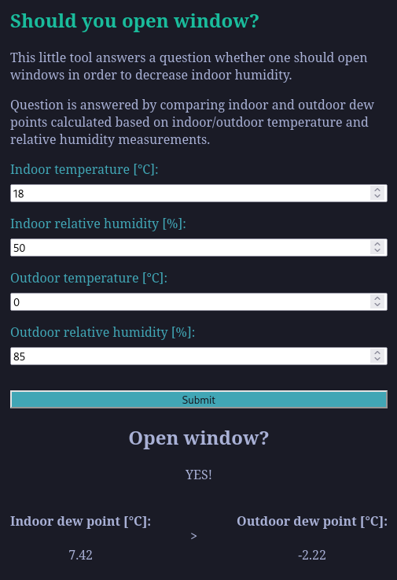

# Open Window Web

Open Window Web is a simple tool trying to answer a question whether one should open windows in order to decrease indoor humidity.

Question is answered by comparing indoor and outdoor dew points calculated based on indoor/outdoor temperature and relative humidity measurements.

Basically, if outdoor dew point is lower than indoor dew point, you should open windows.

Click to see screenshot

## Development

Please check `package.json > scripts` section for a list of available npm commands.

Application depends on and interacts with [owserver REST API](https://github.com/szmergiell/open-window).

## Ideas for improvement

Currently components communicate via props. As application kept growing I started noticing limitations / inconveniences of this solution. If I were to develop this project any further, I would probably refactor components to communicate via context and/or stores instead.

## Motivation

This is just a learning project. The goal is to use technologies that I do not have an opportunity to use in my day job of .NET developer.
